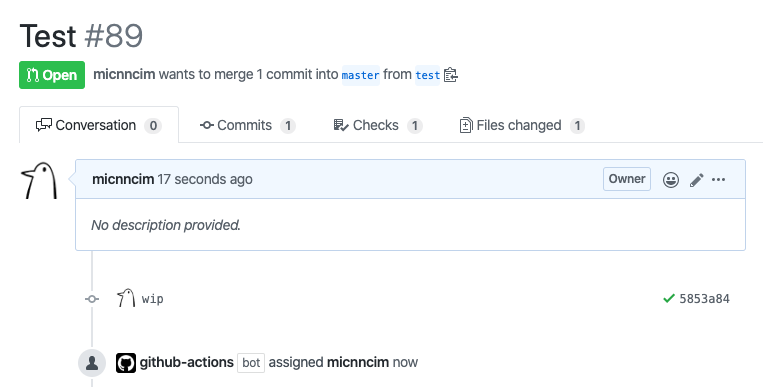

# Action Add Assignees

[![actions-workflow-test][actions-workflow-test-badge]][actions-workflow-test]
[![release][release-badge]][release]
[![license][license-badge]][license]



This is a GitHub Action to add assignees to an issue or a pull request.

It would be more useful to use this with other GitHub Actions' outputs.

## Inputs

|      NAME      |                                             DESCRIPTION                                             |   TYPE   | REQUIRED |          DEFAULT           |
| -------------- | --------------------------------------------------------------------------------------------------- | -------- | -------- | -------------------------- |
| `github_token` | A GitHub token.                                                                                     | `string` | `true`   | `N/A`                      |
| `assignees`    | The assignees' name to be added. Must be separated with line breaks if there're multiple assignees. | `string` | `true`   | `N/A`                      |
| `number`       | The number of the issue or pull request.                                                            | `number` | `false`  | `N/A`                      |
| `repo`         | The owner and repository name. e.g.) `Codertocat/Hello-World`                                       | `string` | `false`  | `${{ github.repository }}` |

## Example

```yaml
name: Auto Assign

on:
  pull_request:
    types:
      - opened
      - reopened

jobs:
  add_labels:
    runs-on: ubuntu-latest
    steps:
      - uses: actions-ecosystem/action-add-assignees@v1
        with:
          github_token: ${{ secrets.github_token }}
          assignees: ${{ github.actor }}
```

## License

Copyright 2020 The Actions Ecosystem Authors.

Action Add Assignees is released under the [Apache License 2.0](./LICENSE).

<!-- badge links -->

[actions-workflow-test]: https://github.com/actions-ecosystem/action-get-merged-pull-request/actions?query=workflow%3ATest
[actions-workflow-test-badge]: https://img.shields.io/github/workflow/status/actions-ecosystem/action-get-merged-pull-request/Test?label=Test&style=for-the-badge&logo=github

[release]: https://github.com/actions-ecosystem/action-get-merged-pull-request/releases
[release-badge]: https://img.shields.io/github/v/release/actions-ecosystem/action-get-merged-pull-request?style=for-the-badge&logo=github

[license]: LICENSE
[license-badge]: https://img.shields.io/github/license/actions-ecosystem/action-get-merged-pull-request?style=for-the-badge
